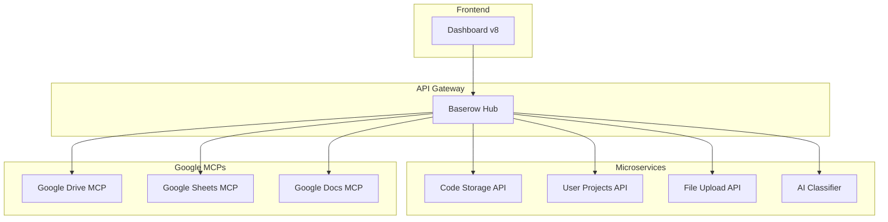

# File Manager v8 - Microservices Architecture

## 🎯 Overview
Modern file management system built with n8n workflow automation, Baserow as central hub, and Google Workspace integration.

## 🏗️ Architecture



## 📋 Project Structure

```
/
├── src/
│   ├── components/       # Reusable n8n code components
│   ├── microservices/    # Individual service implementations
│   ├── frontend/         # Dashboard and UI components
│   └── utils/           # Shared utilities
├── prompts/             # AI prompts library (markdown)
├── workflows/           # n8n workflow exports
├── docs/               # Documentation
└── tests/              # Test files
```

## 🔧 Core Technologies

- **Workflow Engine**: n8n v1.x
- **Database**: Baserow (ID: 278193)
- **File Storage**: Google Drive
- **AI Integration**: Google Gemini, OpenRouter
- **Frontend**: HTML5 + Tailwind CSS
- **Backend**: Node.js (n8n Code nodes)

## 📊 Database Structure

| Table ID | Table Name | Purpose |
|----------|------------|---------|
| 653888 | code_storage | Dynamic code storage |
| 650321 | entries | File upload records |
| 650962 | projects | User projects |
| 652039 | error_logs | Centralized error logging |

## 🚀 Workflows

- **Production**: `lIVd7afgcpijTGSs` (DO NOT MODIFY directly)
- **POC/Dev**: `rJ903l1Uouu0xQYj` (Testing environment)
- **Google MCPs**: `7s55K0wzBOZpS3QQ` (Active in production)

## 📝 Code Standards

### Mandatory Patterns

1. **Try-Catch in ALL components**
```javascript
try {
  // logic
  return [{
    success: true,
    data: result,
    component: 'component_id',
    version: 'v1'
  }];
} catch (error) {
  return [{
    success: false,
    error: error.message,
    component: 'component_id'
  }];
}
```

2. **No hardcoding** - Always fetch from Code Storage
3. **Semantic versioning** - v1.0.0, v1.0.1, etc.
4. **Error logging** - All errors to Baserow table 652039

## 🔗 Active Endpoints

### Google Workspace MCPs
- Drive: `https://primary-production-56785.up.railway.app/webhook/UptaxGDrive`
- Sheets: `https://primary-production-56785.up.railway.app/webhook/UptaxGSheets`
- Docs: `https://primary-production-56785.up.railway.app/webhook/UptaxGDocs`

### Internal Services
- Code Storage: `/webhook/code-storage`
- User Projects: `/webhook/user-projects`
- Dashboard: `/webhook/dashboard`
- File Upload: `/webhook/file-upload`

## 📚 Documentation

- [Architecture Overview](./docs/ARCHITECTURE.md)
- [API Reference](./docs/API.md)
- [Development Guide](./docs/DEVELOPMENT.md)
- [Deployment Guide](./docs/DEPLOYMENT.md)

## 🤝 Contributing

1. Create feature branch
2. Follow code standards
3. Add tests
4. Update documentation
5. Submit PR with clear description

## 📄 License

Private - All rights reserved

## 👥 Team

- Lead Developer: @Uptax-creator
- AI Assistant: Claude (Anthropic)

---
*Last Updated: 2025-09-03*
