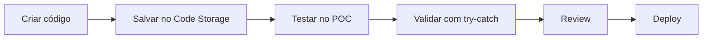

# 🔄 DEVELOPMENT PROCEDURES

## 📝 Workflow de Desenvolvimento

### 1. NUNCA modificar produção diretamente
```yaml
Production: lIVd7afgcpijTGSs  # NÃO TOCAR
POC/Dev: rJ903l1Uouu0xQYj     # Desenvolvimento aqui
Google MCPs: 7s55K0wzBOZpS3QQ # Ativo em produção
```

### 2. Processo de Desenvolvimento



## 🗄️ Code Storage Workflow

### Salvando Código
```javascript
// 1. Escrever código com try-catch
const component = `
try {
  // lógica
  return [{ success: true }];
} catch (error) {
  return [{ success: false }];
}
`;

// 2. Salvar no Baserow (tabela 653888)
POST /webhook/code-storage
{
  "action": "save",
  "component": {
    "component_id": "unique_id",
    "component_type": "processor",
    "code": component,
    "version": "v1.0.0"
  }
}
```

### Carregando Código
```javascript
// Orquestrador busca dinamicamente
const code = await getFromCodeStorage('component_id');
const result = await executeCode(code);
```

## 📊 Baserow Tables

| Table | ID | Purpose |
|-------|-----|---------|
| code_storage | 653888 | Armazena código dinâmico |
| entries | 650321 | Registros de upload |
| projects | 650962 | Projetos de usuários |
| error_logs | 652039 | Logs centralizados |

## 🔒 Credenciais e Segurança

1. **NUNCA commitar credenciais**
2. Use variáveis de ambiente
3. Credenciais no n8n, não no código
4. OAuth2 para Google Services

## 🧪 Testing Protocol

### Antes de Deploy
- [ ] Código tem try-catch?
- [ ] Testado no POC?
- [ ] Error logging funciona?
- [ ] Performance < 2s?
- [ ] Documentação atualizada?

### Teste de Componente
```javascript
// test_component.js
describe('Component Test', () => {
  it('should handle success', async () => {
    const result = await component.execute({ valid: true });
    expect(result[0].success).toBe(true);
  });
  
  it('should handle errors', async () => {
    const result = await component.execute({ invalid: true });
    expect(result[0].success).toBe(false);
  });
});
```

## 🚀 Deployment

### POC → Production
1. Backup workflow de produção
2. Export do POC
3. Import gradual
4. Teste de smoke
5. Monitoramento 30min
6. Rollback se necessário

### Rollback Plan
```bash
# Se algo der errado
1. Stop workflow
2. Restore backup
3. Check error_logs
4. Fix no POC
5. Retry deployment
```

## 📈 Monitoring

### Métricas Essenciais
- Error rate < 1%
- Response time < 200ms
- Success rate > 99%
- Uptime > 99.9%

### Alertas
```javascript
if (errorRate > 0.01) {
  sendAlert('Error rate exceeded 1%');
}
```

## 🔄 Git Workflow

### Branch Strategy
```
main           # Produção
├── develop    # Integração
├── feature/*  # Novas features
├── fix/*      # Bug fixes
└── hotfix/*   # Fixes urgentes
```

### Commit Convention
- `feat:` Nova feature
- `fix:` Bug fix
- `docs:` Documentação
- `refactor:` Refatoração
- `test:` Testes
- `chore:` Manutenção

## ⚠️ REGRAS CRÍTICAS

1. **SEMPRE** backup antes de deploy
2. **NUNCA** delete real (use archive)
3. **SEMPRE** teste no POC primeiro
4. **NUNCA** pule code review
5. **SEMPRE** documente mudanças

---
*Violação destes procedimentos = Rollback imediato*